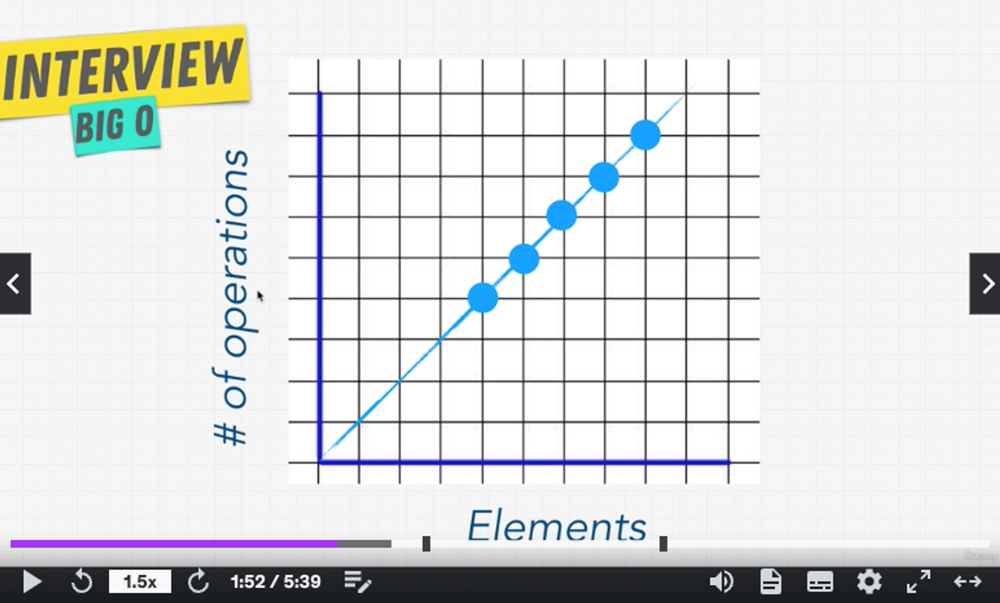
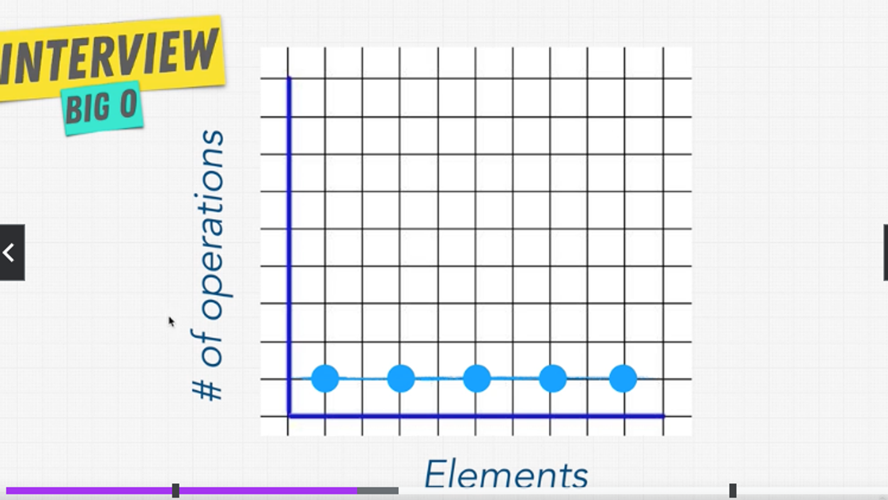

# BigO Notation Asymptotic Analysis

[BigO Cheat Sheet](https://zerotomastery.io/cheatsheets/big-o-cheat-sheet/?utm_source=udemy&utm_medium=coursecontent)

### What is good code?

1. Readable
1. Scalable
   1. Things to consider with scalability:
      1. Speed
      1. Memory -- Computers have limited memory

> BigO is the language we use for talking about how long an algorithm takes to run. We can compare 2 different functions or algorithms using BigO and see which meaures better in scale.

In scalability of code, when we grow bigger and bigger with our input, how much does the algorithm slow down? The more it slows down, the better it is. BigO concerns us with how many steps it takes in a function.


### O(n)

```javascript
const nemo = ['nemo']
const everyone = [
  'dory',
  'bruce',
  'marlin',
  'nemo',
  'gill',
  'bloat',
  'nigel',
  'squirt',
  'darla',
  'hank',
]

const large = new Array(10000).fill('nemo')

function findNemo(array) {
  for (let i = 0; i < array.length; i++) {
    if (array[i] === 'nemo') {
      console.log('Found Nemo!')
    }
  }
}

findNemo(large) // 0(n) --> Linear Time, it takes linear time to find nemo
```



- This indicates that Big O(n) is linear
- As the number of inputs (elements) increase, the number of operations increase as well

### O(1)

```javascript
function compressFirstBox(boxes) {
  console.log(boxes[0])
}
```

```javascript
const boxes = [0, 1, 2, 3, 4, 5]
function logFirstTwoBoxes(boxes) {
  console.log(boxes[0]) // 0(1)
  console.log(boxes[1]) // 0(2)
}

logFirstTwoBoxes(boxes) // 0(2)
```



- Number of operations stay flat no matter how many elements keep increasing
- O(1) Constant Time
- In terms of scalability, it doesn’t matter how big our inputs are, we’re going to a constant amount of time in a function
- In doesn’t matter how many elements we have, it’s always going to run the same — predictability

### What is the difference between big oh, big omega and big theta notations?

Big O, Big Omega, and Big Theta notations are used to describe the rate of growth of a function. Big O notation is used to describe an upper bound on the growth rate of a function. It describes the maximum amount of time or space that an algorithm will take to complete, given a worst-case scenario. Big Omega notation is used to describe a lower bound on the growth rate of a function. It describes the minimum amount of time or space that an algorithm will take to complete, given a best-case scenario. Big Theta notation is used to describe both an upper and lower bound on the growth rate of a function. It describes the exact amount of time or space that an algorithm will take to complete, given an average scenario. In other words, Big O notation gives an upper bound on the growth, Big Omega gives a lower bound, and Big Theta gives both upper and lower bounds.

#### Example:

What is the mileage that your car gives? So let's discuss different scenarios.

Let's say the car gives an average of 12 km/hr in Traffic, an average of 20 km/hr on Highway and an average of 16 km/hr in Normal City Traffic.

Traffic is your worst case, Highway is your best case and Normal City Traffic is your average case.

This is similar to the notations that we use for Algorithm runtime Analysis.

Omega Notation ( Ω ) gives the best case complexity (highway in above case), Big O Notation ( O ) gives the worst case complexity (traffic in above case) and Theta Notation ( θ ) gives the average case complexity of an algorithm (normal city traffic in above case).

Storytelling and real life examples make you understand concepts clearly.

## Rule Book

Rule 1: Worst Case

Rule 2: Remove Constants

Rule 3: Different terms for inputs

Rule 4: Drop Non Dominants

#### Rule 1: Worst Case

#### Rule 2: Remove Constants

- With bigO, we don’t care how steep the line is, we care about how the line moves as our inputs increase
- Drop the constants O(2n), you’re never really going to see the numbers O(n)

#### Rule 3: Different terms for inputs

- Different inputs should have different variables

```javascript
function compressBoxesTwice(boxes, boxes2) {
  boxes.forEach(function (boxes) {
    console.log(boxes)
  })

  boxes2.forEach(function (boxes) {
    console.log(boxes)
  })
}

// O(a + b)
```

- O(a+b)
  - Any notation that is one after the other you add

```javascript
const boxes = ['a', 'b', 'c', 'd', 'e']

function logAllPairsOfArray(array) {
  for (let i = 0; i < array.length; i++) {
    for (let j = 0; j < array.length; j++) {
      console.log(array[i], array[j])
    }
  }
}

logAllPairsOfArray(boxes)

// O(n * n)
// O(n^2) - Quadratic Time
```

- O(a \* b)
  - Any notation that happens that are nested, you multiply

#### Rule 4: Drop Non Dominants

- Or drop non-dominant terms

### What does this all mean?

- BigO helps us scale
- If our inputs are only going to be an array of 5 items, bigO won’t matter as much, all the lines will be on the lower scale of the specture
- As coders, we tend to think of the here now and think that because we only have about 100 users but what if our inputs/user base grows?
  - When we write code, we want to write that can scale so that we don’t have to go back and fix things
  - Or when things go out of hand, we don’t want the code to break
- Companies like google hires engineers and programmers that know this concept because they have a lot of scale that they need to think about
  - They need to handle these types of programs to really code out these types of programs

### O(n!)

- The factorial time or the ohno! factorial
- The most expensive notation

## Which code is best?

- Readable
- Speed — Time complexity
- Memory

### Heap

- Where we store variables that we assign

### Stack

- Where we keep track of our function calls

## Space Complexity vs. Time Complexity

Time complexity and space complexity are two fundamental concepts in the analysis of algorithms, used to describe the efficiency of an algorithm in terms of its use of time and memory, respectively. Here’s a detailed explanation of each:

### Time Complexity

Time complexity refers to the amount of time an algorithm takes to complete as a function of the size of the input. It provides an upper bound on the running time, allowing us to estimate the algorithm’s efficiency and scalability. Time complexity is typically expressed using Big O notation (e.g., O(1)O(1)O(1), O(n)O(n)O(n), O(n2)O(n^2)O(n2)).

**Key Points:**

- **Best-case, Average-case, Worst-case:** These describe the algorithm’s performance under different conditions. Worst-case time complexity is the most commonly discussed, providing a guarantee on the maximum time an algorithm will take.
- **Big O Notation:** This is used to classify algorithms according to how their run time or space requirements grow as the input size grows. For example, O(n) indicates that the run time grows linearly with the input size.
  O(n)O(n)

**Example:**

```javascript
// Linear search: O(n)
function linearSearch(array, target) {
  for (let i = 0; i < array.length; i++) {
    if (array[i] === target) {
      return i
    }
  }
  return -1
}
```

### Space Complexity

Space complexity refers to the amount of memory an algorithm uses as a function of the size of the input. This includes both the memory needed for the input data and any additional memory allocated during the algorithm's execution (e.g., for variables, data structures, recursion stack).

**Key Points:**

- **Auxiliary Space:** This refers specifically to the extra space or temporary space used by the algorithm, excluding the space taken by the inputs.
- **Big O Notation:** Similar to time complexity, space complexity is also expressed using Big O notation to describe how memory requirements grow with input size.

**Example:**

```javascript
// Example with O(n) space complexity
function createArray(n) {
  const array = []
  for (let i = 0; i < n; i++) {
    array.push(i)
  }
  return array
}
```

In this example, the space complexity is O(n)O(n)O(n) because the size of the array grows linearly with the input size.
