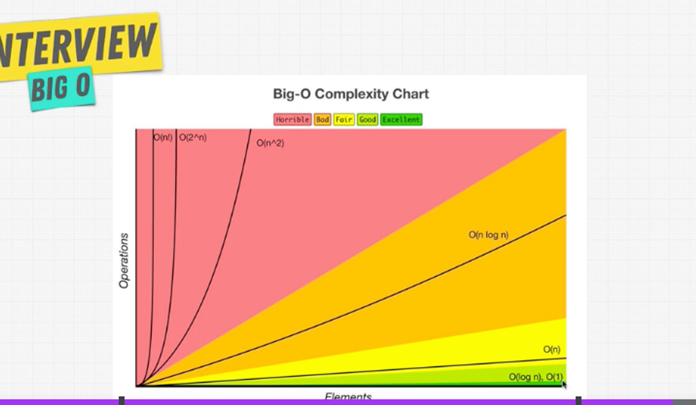

# BigO Notation Asymptotic Analysis

[BigO Cheat Sheet](https://zerotomastery.io/cheatsheets/big-o-cheat-sheet/?utm_source=udemy&utm_medium=coursecontent)

### What is good code?

1. Readable
1. Scalable
   1. Things to consider with scalability:
      1. Speed
      1. Memory -- Computers have limited memory

> BigO is the language we use for talking about how long an algorithm takes to run. We can compare 2 different functions or algorithms using BigO and see which meaures better in scale.

In scalability of code, when we grow bigger and bigger with our input, how much does the algorithm slow down? The more it slows down, the better it is. BigO concerns us with how many steps it takes in a function.

